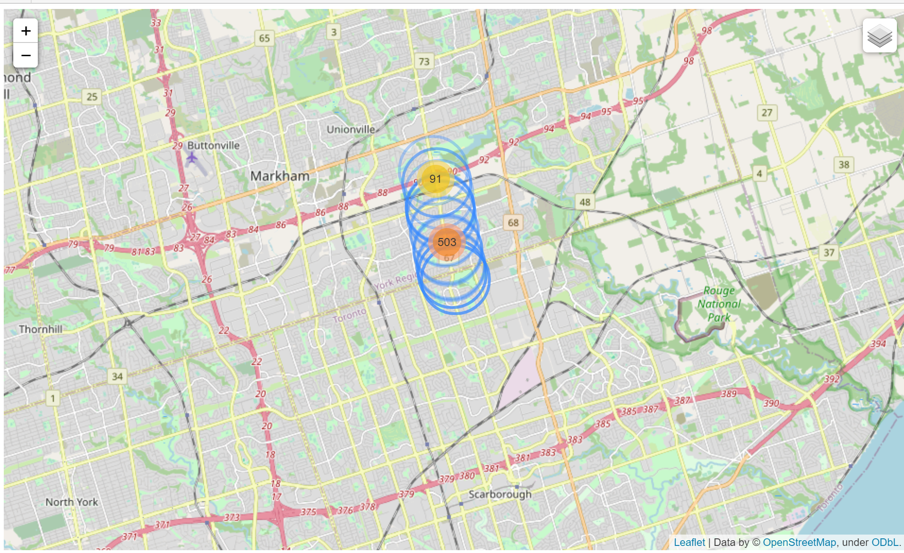
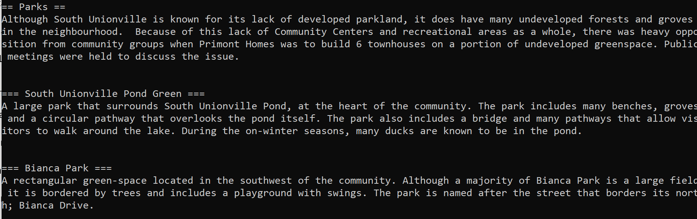
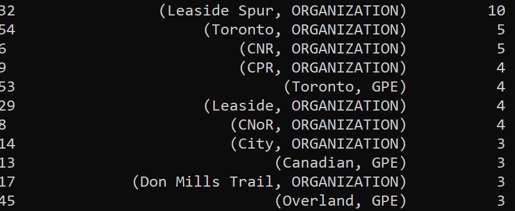
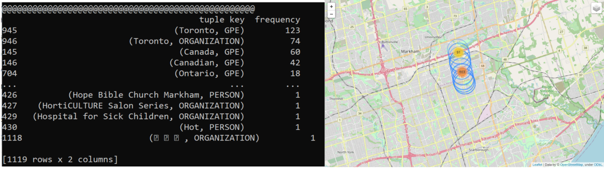

# Wiki_Nearby_Learner (Under Progress)

# Getting Started & Running the Program

1. The free app Termux should be installed on the Android device that will be used when travelling. This allows Python files to be run from the Android terminal emulator 

2. Autosync for Google Drive (DriveSync) should be installed on the Android device if one wishes to make the data transfer automatic. This program takes the saved .csv files saved on the Android device and automatically uploads them to a specified folder within a User's Google Drive. 

# Contents

speedometer.py (Adapted from *link) : From Termux on an Android phone, this script uses the phone's internal GPS and displays latitude and longitude coordinates, as well as the exact time that the coordinates were fetched. Periodically, .csv files of gps coordinates are saved in a predetermined folder. 

quickstart.py : This file checks if the data is found in the specified Google Drive folder -- if so, it downloads the file to a folder on the local machine to be processed. 

main.py : Main file : all subsequent Python files are called upon from this file.

Location_Checker.py : Processes GPS coordinates from the Android phone into a format passed on to subsequent subfiles. 

Wiki_Query.py : Uses the GPS coordinates and Queries the Wikipedia API for any landmarks within a 1 km (customizable) range. 

NLP_Processing_Landmarks.py : Uses NLP to parse all articles from Wikipedia that came up within the 1 km range by collecting proper nouns. 

frequency_NLP.py : From the proper nouns / phrases that were collected, groups these by frequency showing the most frequently used proper nouns (ex : "Toronto") as being displayed first. 

Wiki_Nearby_Learner.ipynb : Jupyter notebook where Folium is used to visualize radii of trip

# Visualizations

Fig 1. Example of a visualizations of "covered" area by the Wikipedia Scraper for a drive from Milliken District Park Northbound to Markham. 

Fig 2. The individual text data from Wikipedia articles.

Fig 3. Most prevalent proper nouns from a single scraped article.

Fig 4. Most prevalent proper nouns across an entire trip.
